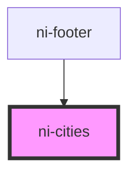

# ni-cities

<!-- Auto Generated Below -->

## Properties

| Property | Attribute | Description | Type  | Default                                                                                                                                                     |
| -------- | --------- | ----------- | ----- | ----------------------------------------------------------------------------------------------------------------------------------------------------------- |
| `items`  | `items`   |             | `any` | `[     { city: "Heredia", phone: "(212) 967-9087" },     { city: "Cartago", phone: "(415) 967-9087" },     { city: "Limon", phone: "(020) 967-9087" },   ]` |

## Dependencies

### Used by

 - [ni-footer](../footer)

### Graph

----------------------------------------------

*Built with [StencilJS](https://stenciljs.com/)*
