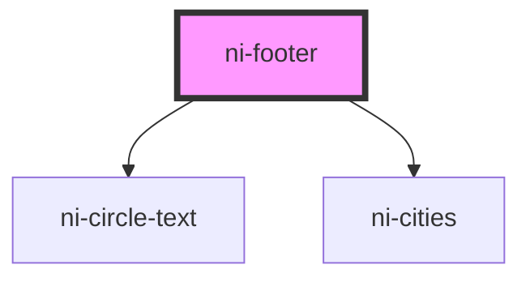

# ni-footer

<!-- Auto Generated Below -->

## Properties

| Property | Attribute | Description | Type     | Default  |
| -------- | --------- | ----------- | -------- | -------- |
| `bg`     | `bg`      |             | `string` | `"#000"` |

## Dependencies

### Depends on

- [ni-circle-text](../circle-text)
- [ni-cities](../cities)

### Graph

----------------------------------------------

*Built with [StencilJS](https://stenciljs.com/)*
